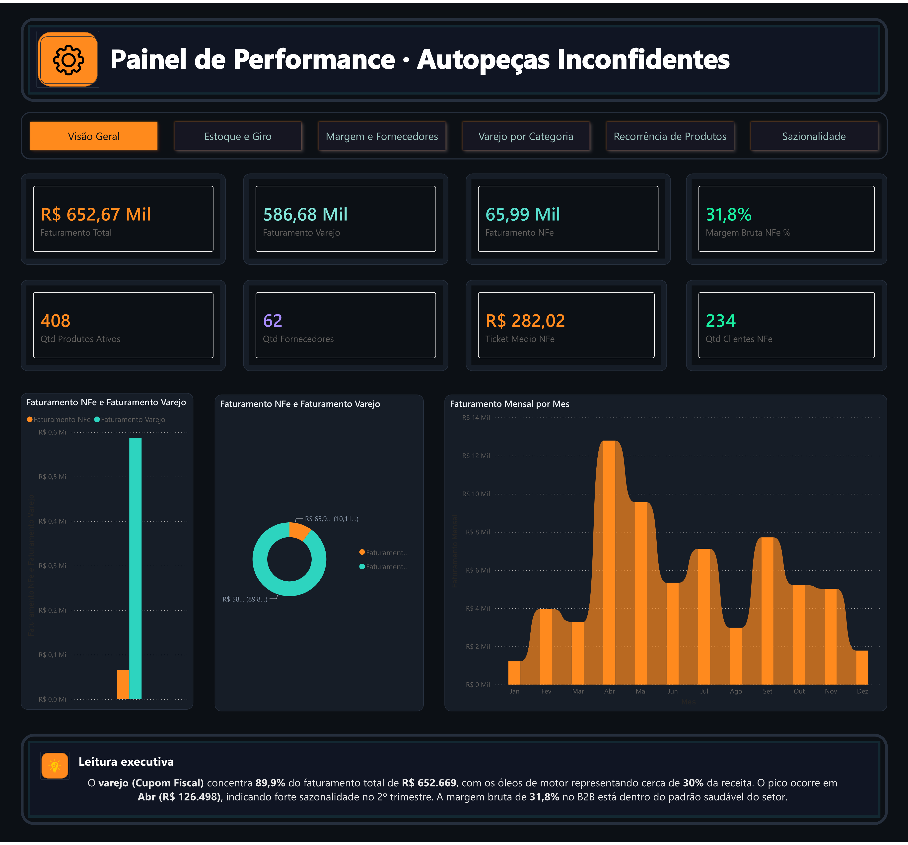
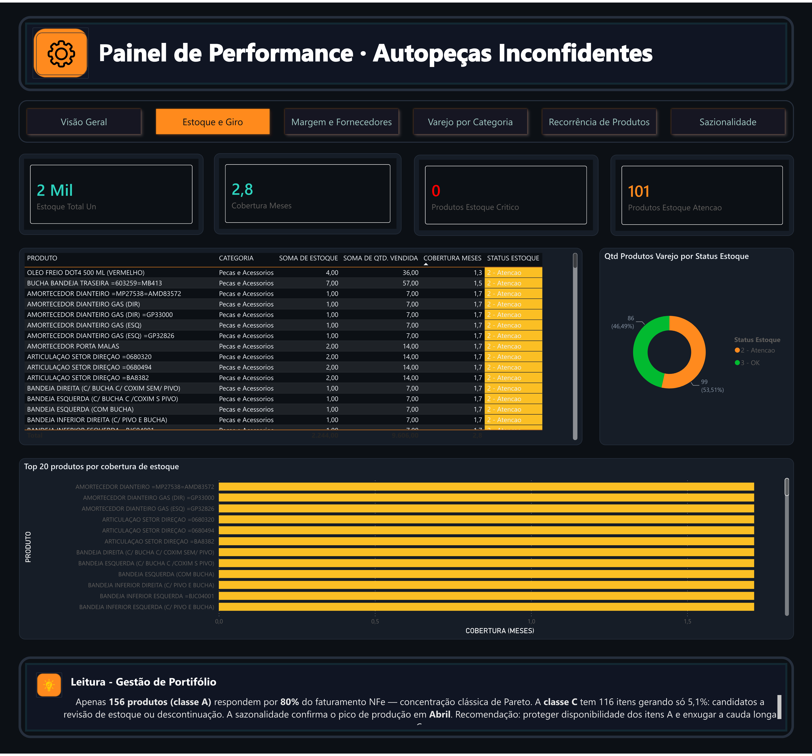
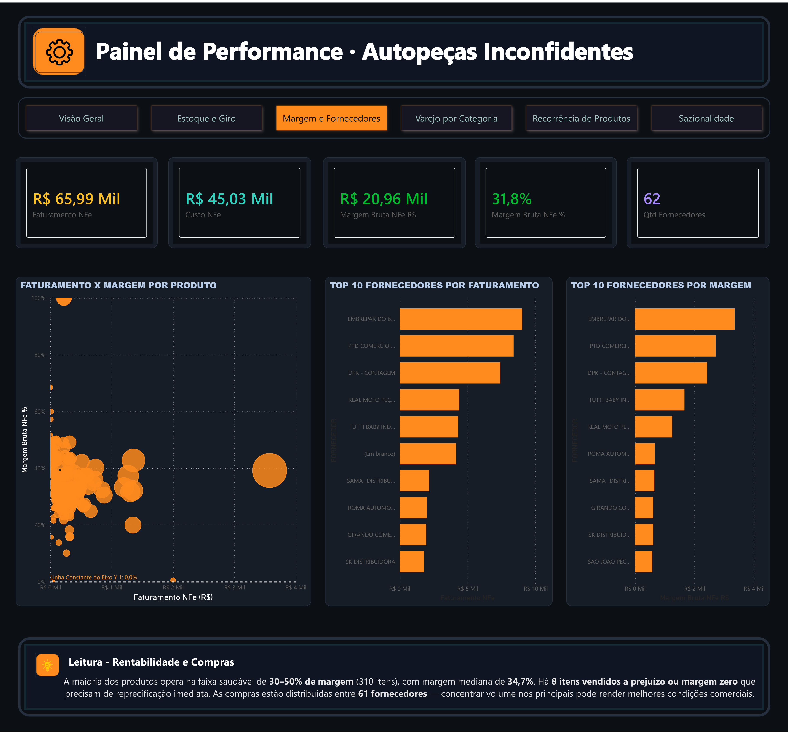
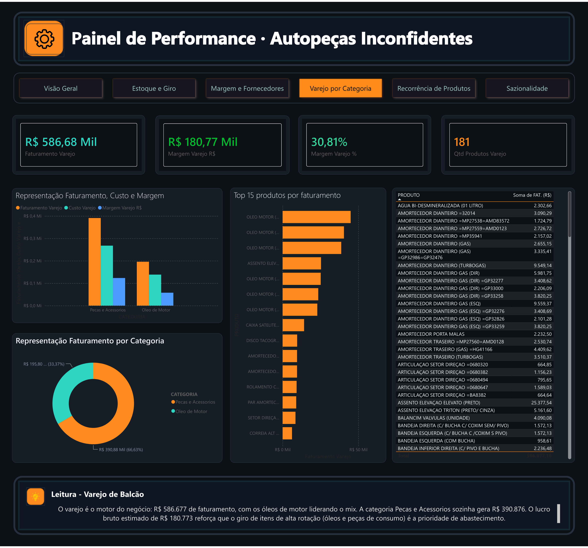
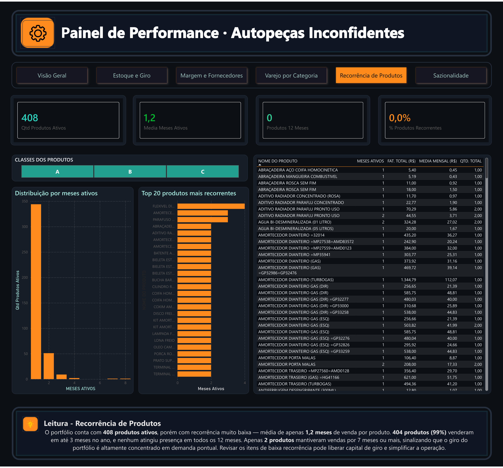
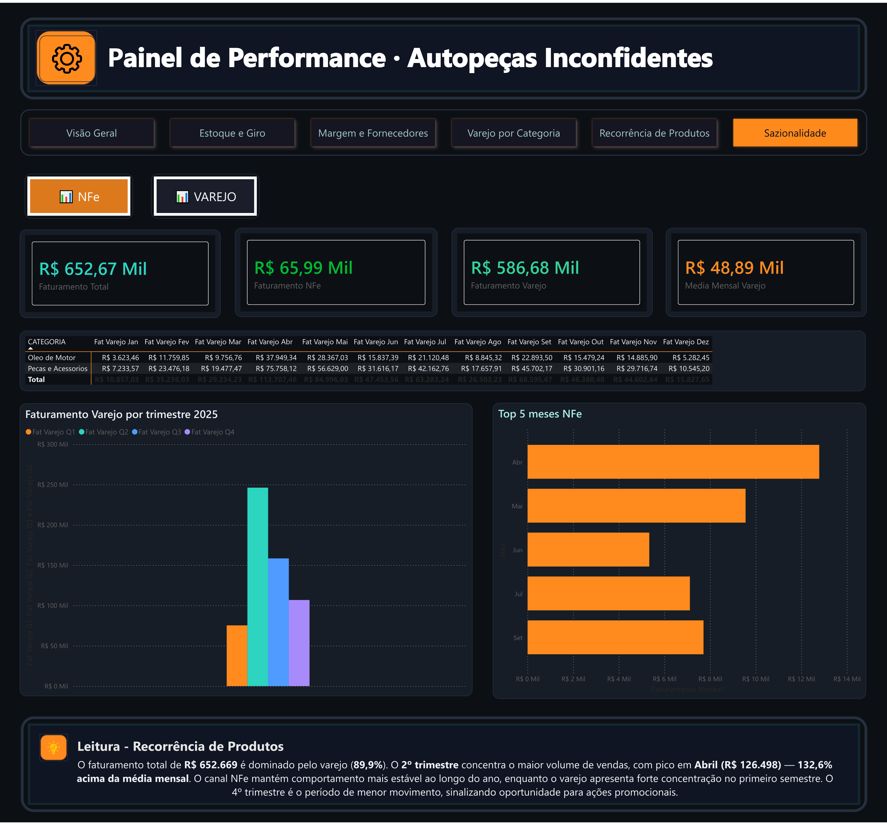

# 5. Dashboard de BI — Painel de Performance

[← Voltar ao índice](../README.md)

Esta seção apresenta o **Painel de Performance da Auto Peças Inconfidentes**, dividido em 6 páginas temáticas que respondem às KIQs definidas na [seção 2](02-necessidades-ic.md).

> 📥 **Arquivo original (PDF):** [dashboard-completo.pdf](assets/dashboard-completo.pdf)

---

## Página 1 — Visão Geral

### KPIs principais

| Indicador | Valor |
|---|---|
| **Faturamento Total** | R$ 652,67 mil |
| **Faturamento Varejo** (Cupom Fiscal / B2C) | R$ 586,68 mil |
| **Faturamento NFe** (B2B) | R$ 65,99 mil |
| **Margem Bruta NFe** | 31,8% |
| **Ticket Médio NFe** | R$ 282,02 |
| **Qtd. Produtos Ativos** | 408 |
| **Qtd. Fornecedores** | 62 |
| **Qtd. Clientes NFe** | 234 |

### Leitura executiva

O varejo (Cupom Fiscal) concentra **89,9% do faturamento total** de R$ 652.669, com os óleos de motor representando cerca de **30% da receita**. O pico ocorre em **Abril (R$ 126.498)**, indicando forte sazonalidade no 2º trimestre. A margem bruta de **31,8% no B2B** está dentro do padrão saudável do setor.

---

## Página 2 — Estoque e Giro

### KPIs principais

| Indicador | Valor |
|---|---|
| **Estoque Total** | ~2 mil unidades |
| **Cobertura (meses)** | 2,8 |
| **Produtos em Estoque Crítico** | 0 |
| **Produtos em Estoque Atenção** | 101 |

### Status de estoque

- 🟢 **OK:** 86 produtos (46,49%)
- 🟡 **Atenção:** 99 produtos (53,51%)

### Leitura — Gestão de Portfólio

Apenas **156 produtos (classe A)** respondem por **80% do faturamento NFe** — concentração clássica de Pareto. A **classe C tem 116 itens gerando só 5,1%**: candidatos a revisão de estoque ou descontinuação. A sazonalidade confirma o pico de produção em Abril.

> **Recomendação:** proteger disponibilidade dos itens A e enxugar a cauda longa (classe C).

---

## Página 3 — Margem e Fornecedores

### KPIs principais

| Indicador | Valor |
|---|---|
| **Faturamento NFe** | R$ 65,99 mil |
| **Custo NFe** | R$ 45,03 mil |
| **Margem Bruta NFe (R$)** | R$ 20,96 mil |
| **Margem Bruta NFe (%)** | 31,8% |

### Top fornecedores

- EMBREPAR DO BRASIL
- PTD COMÉRCIO
- DPK — CONTAGEM
- REAL MOTO PEÇAS
- TUTTI BABY IND.
- SAMA — DISTRIBUIDOR
- ROMA AUTOMOTIVA
- GIRANDO COMÉRCIO
- SK DISTRIBUIDORA

### Leitura — Rentabilidade e Compras

A maioria dos produtos opera na faixa saudável de **30–50% de margem (310 itens)**, com margem mediana de **34,7%**. Há **8 itens vendidos a prejuízo ou margem zero** que precisam de reprecificação imediata. As compras estão distribuídas entre **61 fornecedores** — concentrar volume nos principais pode render melhores condições comerciais.

---

## Página 4 — Varejo por Categoria

### KPIs principais

| Indicador | Valor |
|---|---|
| **Faturamento Varejo** | R$ 586,68 mil |
| **Margem Varejo (R$)** | R$ 180,77 mil |
| **Margem Varejo (%)** | 30,81% |
| **Qtd. Produtos Varejo** | 181 |

### Composição por categoria

| Categoria | Faturamento | % |
|---|---|---|
| **Peças e Acessórios** | R$ 390,88 mil | 66,63% |
| **Óleo de Motor** | R$ 195,80 mil | 33,37% |

### Top produtos por faturamento (varejo)

Liderança absoluta dos **óleos de motor**, seguidos por amortecedores dianteiros (gás/turbogas), assento elevação ELEVATO (R$ 25 mil), discos de tacógrafo e setor direção.

### Leitura — Varejo de Balcão

O varejo é o motor do negócio: **R$ 586.677 de faturamento**, com os óleos de motor liderando o mix. A categoria *Peças e Acessórios* sozinha gera **R$ 390.876**. O lucro bruto estimado de **R$ 180.773** reforça que o giro de itens de alta rotação (óleos e peças de consumo) é a prioridade de abastecimento.

---

## Página 5 — Recorrência de Produtos

### KPIs principais

| Indicador | Valor |
|---|---|
| **Qtd. Produtos Ativos** | 408 |
| **Média de Meses Ativos** | 1,2 |
| **Produtos vendidos em 12 meses** | 0 |
| **% Produtos Recorrentes** | 0,0% |

### Distribuição

- Classes ABC dos produtos (curva de Pareto)
- Top 20 produtos mais recorrentes
- Distribuição por meses ativos

### Leitura — Recorrência de Produtos

O portfólio conta com **408 produtos ativos**, porém com recorrência muito baixa — média de **apenas 1,2 meses de venda por produto**. **404 produtos (99%)** venderam em até 3 meses no ano, e **nenhum atingiu presença em todos os 12 meses**. Apenas 2 produtos mantiveram vendas por 7 meses ou mais, sinalizando que o giro do portfólio é **altamente concentrado em demanda pontual**.

> **Recomendação:** revisar os itens de baixa recorrência pode liberar capital de giro e simplificar a operação.

---

## Página 6 — Sazonalidade

### KPIs principais

| Indicador | Valor |
|---|---|
| **Faturamento Total** | R$ 652,67 mil |
| **Faturamento NFe** | R$ 65,99 mil |
| **Faturamento Varejo** | R$ 586,68 mil |
| **Média Mensal Varejo** | R$ 48,89 mil |

### Faturamento varejo por mês (R$)

| Mês | Óleo de Motor | Peças e Acessórios | **Total** |
|---|---|---|---|
| Jan | 3.623 | 7.234 | **10.857** |
| Fev | 11.760 | 23.476 | **35.236** |
| Mar | 9.757 | 19.477 | **29.234** |
| **Abr** | **37.949** | **75.758** | **113.707** |
| Mai | 28.367 | 56.629 | **84.996** |
| Jun | 15.837 | 31.616 | **47.454** |
| Jul | 21.120 | 42.163 | **63.283** |
| Ago | 8.845 | 17.658 | **26.503** |
| Set | 22.893 | 45.702 | **68.596** |
| Out | 15.479 | 30.901 | **46.380** |
| Nov | 14.886 | 29.717 | **44.603** |
| Dez | 5.282 | 10.545 | **15.828** |

### Top 5 meses NFe

Abr → Mai → Jun → Jul → Set

### Leitura — Sazonalidade

O faturamento total de **R$ 652.669** é dominado pelo varejo (89,9%). O **2º trimestre concentra o maior volume de vendas**, com pico em **Abril (R$ 126.498) — 132,6% acima da média mensal**. O canal NFe mantém comportamento mais estável ao longo do ano, enquanto o varejo apresenta forte concentração no primeiro semestre. O **4º trimestre é o período de menor movimento**, sinalizando oportunidade para ações promocionais.

---

## Consolidado dos achados

| Achado | Implicação para a decisão de reposição |
|---|---|
| 89,9% do faturamento é B2C (Cupom Fiscal) | Priorizar abastecimento de itens de balcão (óleos, peças de consumo) |
| 30% da receita vem de óleos de motor | Proteger nível de serviço dessa categoria |
| Pico em Abril +132,6% da média | Antecipar compras em Fev/Mar para suportar 2º trim. |
| Q4 com menor movimento | Aproveitar para campanhas e queima de estoque parado |
| 156 produtos (classe A) = 80% do faturamento | Aplicar Pareto: foco nesses itens A |
| 116 itens classe C = apenas 5,1% | Avaliar descontinuação ou redução de cobertura |
| 99% dos produtos venderam em ≤3 meses | Portfólio com demanda pontual → reduzir cauda longa |
| 8 itens com prejuízo/margem zero | Reprecificação imediata |
| 61 fornecedores | Consolidar volume nos principais para melhores condições |

---

[← 4. PETI](04-peti.md) · [Voltar ao índice](../README.md) · [Próximo: 6. Apresentação →](06-apresentacao-final.md)
